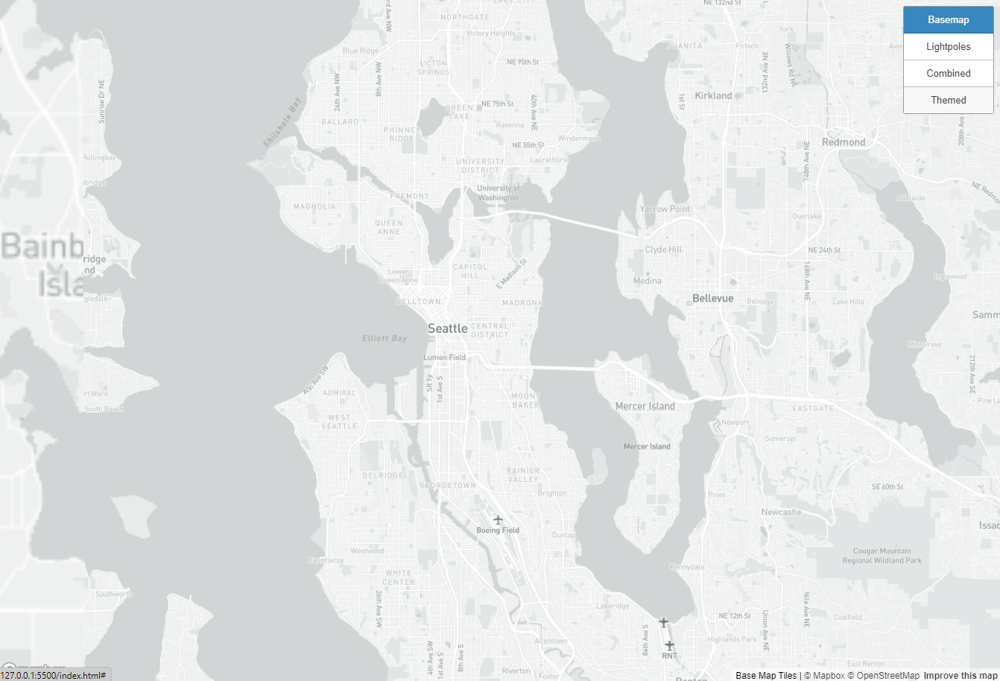
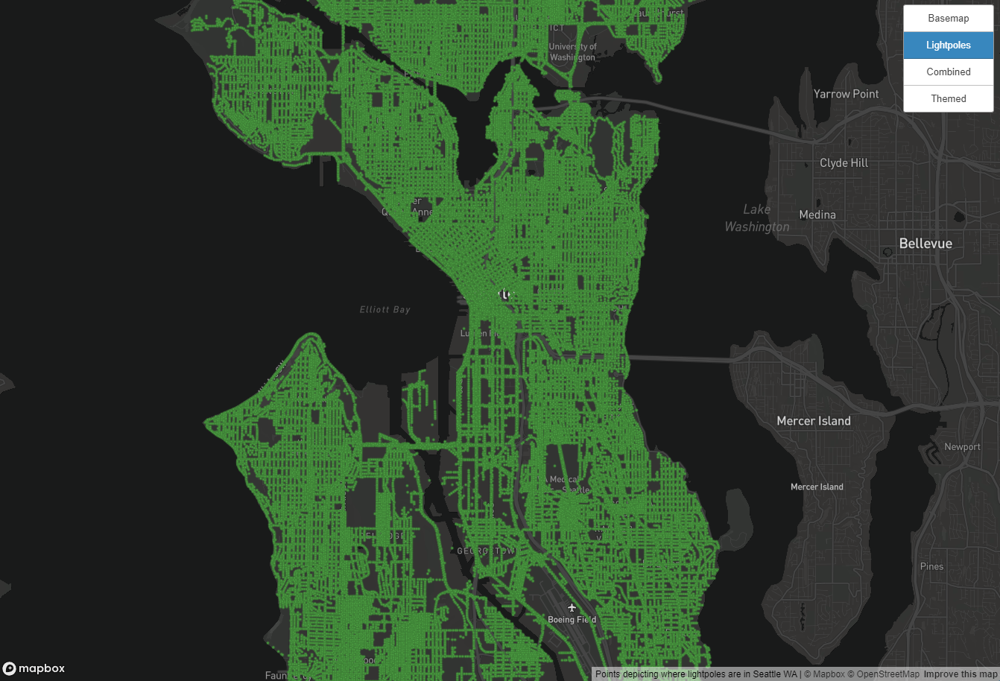
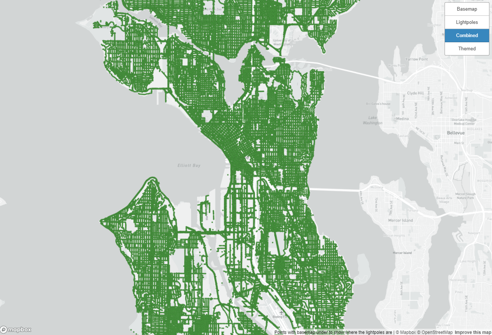
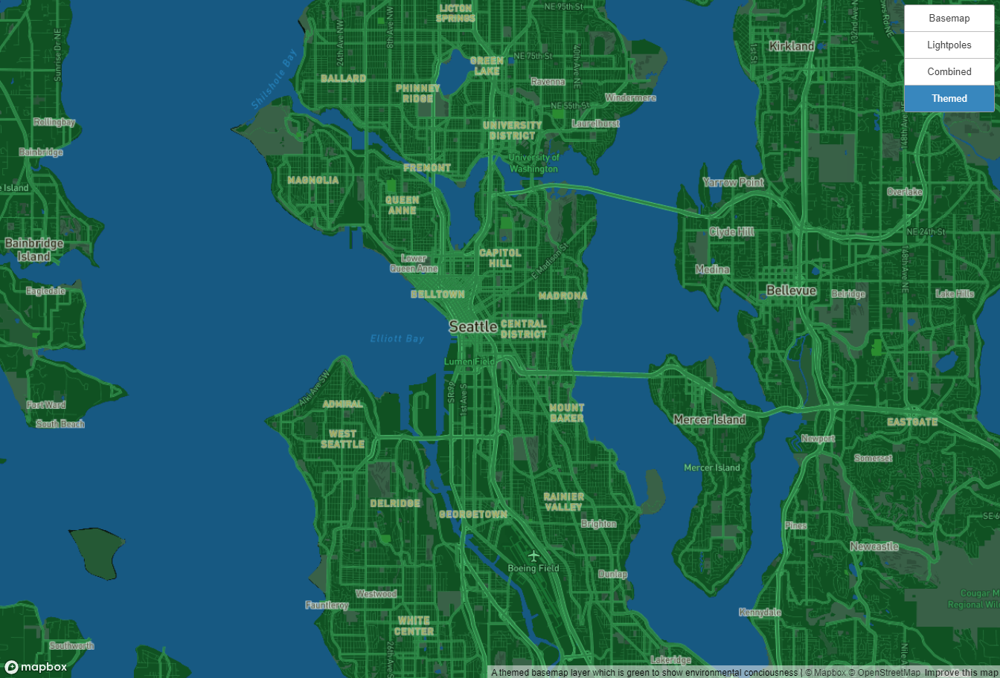

# Lightpoles in Seattle, WA

In this lab, we have tiles sets of a basemap, lightpoles in Seattle through point data, the lightpoles shown on top of the basemap, and a map that is themed after the environment. The geographic area that we are examining is Seattle. I chose this beacuse my final project will be about energy useage in Seattle, WA. Although we are not specifically looking at lightpoles in my project, lightpoles are placed by the city government and they still use energy to power throughout the night. Examining where these lightpoles are located can help us see which areas use the most energy in Seattle. Each tile set is available to zoom to street level of the city. Since the data points are only within Seattle, there is no need to make the tiles zoom out further than the greater Seattle area. 

The first tile set makes up the general basemap. This basemap is in a grey tone to avoid emphasizing elements that are not meant to stand out. In order to keep the audience's attention on the points shown later, the basemap is meant to be plain and only show necessary details such as street names, neighborhoods, and important landmarks. 

The second tile set makes up the point data of the lightpoles in Seattle. Since there is already a basemap available in the webmap, we can see where the points are located within the city. However, without the light grey basemap implemented, it is quite hard to see more in more detail where the points are located. The bright green of the points do not contrast well with the dark basemap, making it harder for the audience to properly see the data.

The third tile set makes up the combined basemap and point data. As seen compared to just the points alone, the light grey basemap creates a nice contrast in order for the map viewer to distinguish the more significant points. In this, we can see where all the lightpoles are located and easily see the streets that they occupy.

The last tile set makes up a themed map. The theme of the map is tied to the environment, with green being the primary color of the map and blue to show the bodies of water. Some labels are also shown in yellow to represent the light from the lightpoles. 

[Click here to view Webmap](http://127.0.0.1:5500/index.html)